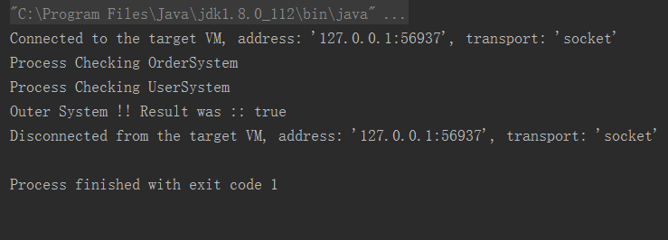

### CountDownLatch的简单使用
> CountDownLatch这个类能够使一个线程等待其他线程完成各自的工作后再执行.

#### CountDownLatch的简单实用实例01[子任务等待主任务完成]
```java
package com.jhon.rain.countdown;

import java.util.concurrent.CountDownLatch;

/**
 * <p>功能描述</br> CountDownLatch简单使用案例 </p>
 *
 * @author jiangy19
 * @version v1.0
 * @FileName SubWaitMain
 * @date 2017/10/9 11:36
 */
public class Mainer {

	public static void main(String[] args) throws Exception {
		CountDownLatch startSignal = new CountDownLatch(1);
		CountDownLatch doneSignal = new CountDownLatch(5);

		/** 依次创建5个worker线程 **/
		for (int i=0; i<5;i++) {
			new Thread(new Worker(startSignal,doneSignal)).start();
		}

		System.out.println(SubWaitMain);
		Thread.sleep(5000);
		System.out.println(SubWaitMain);
		startSignal.countDown();
		doneSignal.await();
		System.out.println("Woker Is Finished...");
	}

	/**
	 * Subworker Thread
	 **/
	static class Worker implements Runnable {

		private final CountDownLatch startSignal;

		private final CountDownLatch doneSignal;

		Worker(CountDownLatch startSignal, CountDownLatch doneSignal) {
			this.startSignal = startSignal;
			this.doneSignal = doneSignal;
		}

		@Override
		public void run() {
			try {
				startSignal.await();
				System.out.println(Thread.currentThread().getName()+" Working Starting ... ");
				/** 当前worker执行完毕，释放一个完成信号 **/
				doneSignal.countDown();
			} catch (InterruptedException e) {
				e.printStackTrace();
			}
		}
	}
}

```

#### CountDownLatch的简单实用实例01[主任务等待子任务完成]
```java
package com.jhon.rain.countdown;

import java.util.concurrent.CountDownLatch;

/**
 * <p>功能描述</br> 主任务等待子任务完成之后才能完成 </p>
 *
 * @author jiangy19
 * @version v1.0
 * @FileName MainWaitSub
 * @date 2017/10/9 11:57
 */
public class MainWaitSub {

	public static void main(String[] args) throws Exception {
		CountDownLatch startSignal = new CountDownLatch(1);
		CountDownLatch doneSignal = new CountDownLatch(5);

		for (int i = 0; i < 5; i++) {
			new Thread(new Worker(startSignal, doneSignal)).start();
		}
		doneSignal.await();
		System.out.println("Sub Worker Is Done All Task...");
		new Thread(() -> {
			startSignal.countDown();
		}).start();
		startSignal.await();
		System.out.println("Main Task Is Starting Process...");
		System.out.println("Main Task Is Finished...");
	}


	static class Worker implements Runnable {

		private final CountDownLatch startSignal;

		private final CountDownLatch doneSignal;

		public Worker(CountDownLatch startSignal, CountDownLatch doneSignal) {
			this.startSignal = startSignal;
			this.doneSignal = doneSignal;
		}

		@Override
		public void run() {
			System.out.println("ThreadName=" + Thread.currentThread().getName() + " Process Finished !");
			doneSignal.countDown();
		}
	}
}
```

#### CountDownLatch复杂使用场景
##### 外围系统检查的抽象类
```java
package com.jhon.rain.countdown;

import java.util.concurrent.CountDownLatch;

/**
 * <p>功能描述</br> CountDownLatch并发类的案例 </p>
 * <p>
 * 1.解释一下CountDownLatch概念?
 *   CountDownLatch是通过一个计数器来实现的，计数器的初始值为线程的数量。
 *   每当一个线程完成了自己的任务后，计数器的值就会减1。
 *   当计数器值到达0时，它表示所有的线程已经完成了任务，然后在闭锁上等待的线程就可以恢复执行任务。
 *
 * 2.CountDownLatch 和 CyclicBarrier的不同之处?
 *  2.1 CountDownLatch减计数，CyclicBarrier加计数
 *
 *  2.2 CountDownLatch是一次性的，CyclicBarrier可以重用
 *
 *  2.3 CountDownLatch强调的是一个线程（或多个）需要等待另外的n个线程干完某件事情之后才能继续执行
 *    [
 *     A synchronization aid that allows one or more threads to wait until
 *     a set of operations being performed in other threads completes.
 *    ]
 *  2.4 CyclicBarrier强调的是n个线程，大家相互等待，只要有一个没完成，所有人都得等着
 *    [
 *      A synchronization aid that allows a set of threads to all wait for
 *      each other to reach a common barrier point.  CyclicBarriers are
 *      useful in programs involving a fixed sized party of threads that
 *      must occasionally wait for each other. The barrier is called
 *      <em>cyclic</em> because it can be re-used after the waiting threads
 *      are released.
 *    ]
 *
 * 3.给出一些CountDownLatch使用的例子?
 *
 * 4.CountDownLatch 类中主要的方法?
 *   countDown();
 *   await(); 调用await()方法的线程会被挂起，它会等待直到count值为0才继续执行
 *   await(long timeout, TimeUnit unit); 和await()类似，只不过等待一定的时间后count值还没变为0的话就会继续执行
 * </p>
 *
 * @author jiangy19
 * @version v1.0
 * @FileName BaseOuterSysChecker
 * @date 2017/10/9 11:24
 */
public abstract class BaseOuterSysChecker implements Runnable {

	private CountDownLatch startLatch;

	private String sysId;

	private boolean sysStatus;

	public BaseOuterSysChecker(CountDownLatch startLatch, String sysId) {
		this.startLatch = startLatch;
		this.sysId = sysId;
		this.sysStatus = Boolean.FALSE;
	}

	public String getSysId() {
		return sysId;
	}

	public boolean isSysStatus() {
		return sysStatus;
	}

	@Override
	public void run() {
		try {
			sysStatus = varifySystem();
		} catch (Throwable t) {
			t.printStackTrace(System.err);
			sysStatus = false;
		} finally {
			if (startLatch != null) {
				startLatch.countDown();
			}
		}
	}

	/**
	 * 检查系统
	 *
	 * @return
	 */
	abstract boolean varifySystem();
}
```
##### 模拟用户系统检查逻辑
```java
package com.jhon.rain.countdown;

import java.util.concurrent.CountDownLatch;

/**
 * <p>功能描述</br> 用户系统检查 </p>
 *
 * @author jiangy19
 * @version v1.0
 * @FileName UserSystem
 * @date 2017/10/9 14:14
 */
public class UserSystem extends BaseOuterSysChecker {

	public UserSystem(CountDownLatch latch) {
		super(latch, "UserSystem");
	}

	@Override
	boolean varifySystem() {
		System.out.println("Process Checking " + this.getSysId());
		boolean result = false;
		try {
			Thread.sleep(6000);
			result = true;
		} catch (InterruptedException e) {
			e.printStackTrace();
			result = false;
		}
		return result;
	}
}

```

##### 模拟订单系统检查逻辑
```java
package com.jhon.rain.countdown;

import java.util.concurrent.CountDownLatch;

/**
 * <p>功能描述</br> 订单管理系统 </p>
 *
 * @author jiangy19
 * @version v1.0
 * @FileName OrderSystem
 * @date 2017/10/9 14:14
 */
public class OrderSystem extends BaseOuterSysChecker {

	public OrderSystem(CountDownLatch latch) {
		super(latch, "OrderSystem");
	}

	@Override
	boolean varifySystem() {
		System.out.println("Process Checking " + this.getSysId());
		boolean result = false;
		try {
			Thread.sleep(5000);
			result = true;
		} catch (InterruptedException e) {
			e.printStackTrace();
			result = false;
		}
		return result;
	}
}

```

##### 执行检查的工具类
```java
package com.jhon.rain.countdown;

import java.util.ArrayList;
import java.util.List;
import java.util.concurrent.CountDownLatch;
import java.util.concurrent.Executor;
import java.util.concurrent.Executors;

/**
 * <p>功能描述</br> 系统启动的检查工具 </p>
 *
 * @author jiangy19
 * @version v1.0
 * @FileName AppStartUtil
 * @date 2017/10/9 14:22
 */
public class AppStartUtil {

	private AppStartUtil() {
	}

	private static class StartHolder {
		private final static AppStartUtil INSTANCE = new AppStartUtil();
	}

	public static AppStartUtil getInstance() {
		return StartHolder.INSTANCE;
	}

	private static List<BaseOuterSysChecker> checkers = new ArrayList<>();

	private static CountDownLatch latch;

	/**
	 * 执行检查的处理
	 * @return
	 * @throws InterruptedException
	 */
	public boolean checkProcess() throws InterruptedException {

		latch = new CountDownLatch(2);

		checkers.add(new UserSystem(latch));
		checkers.add(new OrderSystem(latch));

		Executor executors = Executors.newFixedThreadPool(checkers.size());

		for (final BaseOuterSysChecker checker : checkers) {
			executors.execute(checker);
		}

		latch.await();

		for (final BaseOuterSysChecker checker : checkers) {
			if(!checker.isSysStatus()){
				return false;
			}
		}
		return true;
	}
}

```

##### 模拟运行检查逻辑
```java
package com.jhon.rain.countdown;

/**
 * <p>功能描述</br> 运行程序 </p>
 *
 * @author jiangy19
 * @version v1.0
 * @FileName AppRunner
 * @date 2017/10/9 14:34
 */
public class AppRunner {

	public static void main(String[] args) throws Exception {
		boolean result = false;
		try {
			result = AppStartUtil.getInstance().checkProcess();
		} catch (Exception e) {
			e.printStackTrace();
		}
		System.out.println("Outer System !! Result was :: "+ result);
	}
}

```

##### 运行结果
