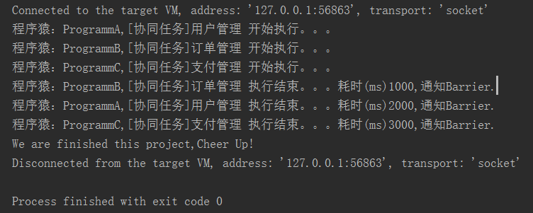

### CyclicBarrier 使用
> 1.CountDownLatch 和 CyclicBarrier的不同之处?

>  1.1 CountDownLatch减计数，CyclicBarrier加计数
  
>  1.2 CountDownLatch是一次性的，CyclicBarrier可以重用
  
>  1.3 CountDownLatch强调的是一个线程（或多个）需要等待另外的n个线程干完某件事情之后才能继续执行

>   
    A synchronization aid that allows one or more threads to wait until
    a set of operations being performed in other threads completes.
    
>  1.4 CyclicBarrier强调的是n个线程，大家相互等待，只要有一个没完成，所有人都得等着
>    
     A synchronization aid that allows a set of threads to all wait for
     each other to reach a common barrier point.  CyclicBarriers are
     useful in programs involving a fixed sized party of threads that
     must occasionally wait for each other. The barrier is called
     <em>cyclic</em> because it can be re-used after the waiting threads
     are released.
    
#### 模拟使用场景：
　　作为程序猿，每次针对一个项目的开发时候，PM一般都会叫程序员们去领粮食，每个程序猿一般都是自己领一个模块去单独开发，这样就可以保证多个模块之间的工作开展可以并发的执行，**当每个猿的模块开发测试完成通过后**，PM一般都会组织一个小小的庆祝！

#### 代码实现
##### 程序猿
```java
package com.jhon.rain.cyclebarrier;

import java.util.concurrent.BrokenBarrierException;
import java.util.concurrent.CyclicBarrier;

/**
 * <p>功能描述</br> 程序员处理特定的模块 </p>
 *
 * @author jiangy19
 * @version v1.0
 * @FileName Programmer
 * @date 2017/10/9 15:36
 */
public class Programmer extends Thread {

	private String moduleName;

	private String programmerName;

	private CyclicBarrier cyclicBarrier;

	private int needTime;

	public Programmer(String moduleName, String programmerName, int needTime, CyclicBarrier barrier) {
		this.moduleName = moduleName;
		this.programmerName = programmerName;
		this.needTime = needTime;
		this.cyclicBarrier = barrier;
	}

	@Override
	public void run() {
		System.out.println("程序猿："+programmerName+",[协同任务]"+moduleName+" 开始执行。。。");
		try {
			Thread.sleep(needTime);
		} catch (InterruptedException e) {
			e.printStackTrace();
		}
		System.out.println("程序猿："+programmerName+",[协同任务]"+moduleName+" 执行结束。。。耗时(ms)"+needTime+",通知Barrier.");
		try {
			cyclicBarrier.await();
		} catch (InterruptedException e) {
			e.printStackTrace();
		} catch (BrokenBarrierException e) {
			e.printStackTrace();
		}
	}
}

```

#### 庆祝时刻
```java
package com.jhon.rain.cyclebarrier;

/**
 * <p>功能描述</br> 庆祝时刻 </p>
 *
 * @author jiangy19
 * @version v1.0
 * @FileName CelebrationTime
 * @date 2017/10/9 15:35
 */
public class CelebrationTime implements Runnable {

	@Override
	public void run() {
		System.out.println("PM：We are finished this project,Cheer Up!");
	}
}
```

##### PM
```java
package com.jhon.rain.cyclebarrier;

import java.util.concurrent.CyclicBarrier;

/**
 * <p>功能描述</br> 项目经理分配任务 </p>
 * <p>Result</p>
 * <p>
 * 程序猿：ProgrammA,[协同任务]用户管理 开始执行。。。
 * 程序猿：ProgrammB,[协同任务]订单管理 开始执行。。。
 * 程序猿：ProgrammC,[协同任务]支付管理 开始执行。。。
 * 程序猿：ProgrammB,[协同任务]订单管理 执行结束。。。耗时(ms)1000,通知Barrier.
 * 程序猿：ProgrammA,[协同任务]用户管理 执行结束。。。耗时(ms)2000,通知Barrier.
 * 程序猿：ProgrammC,[协同任务]支付管理 执行结束。。。耗时(ms)3000,通知Barrier.
 * We are finished this project,Cheer Up!
 * <p>
 * </p>
 *
 * @author jiangy19
 * @version v1.0
 * @FileName ProjectManager
 * @date 2017/10/9 15:43
 */
public class ProjectManager {

	public static void main(String[] args) throws Exception {
		CyclicBarrier cyclicBarrier = new CyclicBarrier(3, new CelebrationTime());
		new Programmer("用户管理", "ProgrammA", 2000, cyclicBarrier).start();
		new Programmer("订单管理", "ProgrammB", 1000, cyclicBarrier).start();
		new Programmer("支付管理", "ProgrammC", 3000, cyclicBarrier).start();
	}
}
```

#### 执行结果

