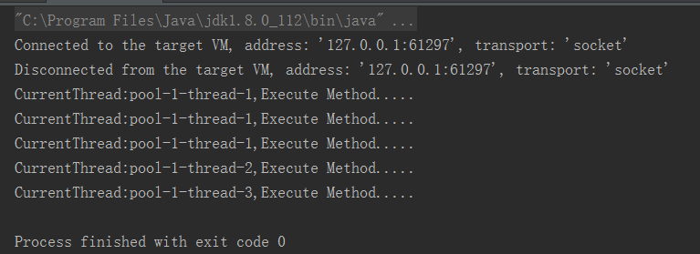
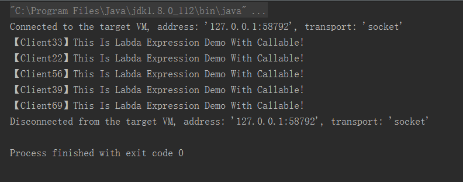
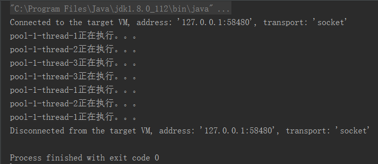

#### Executors 线程池

> Executors提供了一系列工厂方法用于创先线程池，返回的线程池都实现了ExecutorService接口.

> 创建固定数目线程的线程池：public static ExecutorService newFixedThreadPool(int nThreads)

> 创建一个可缓存的线程池：public static ExecutorService newCachedThreadPool()

> 创建一个单线程化的Executor：public static ExecutorService newSingleThreadExecutor()

> 创建一个支持定时及周期性的任务执行的线程池，多数情况下可用来替代Timer类：public static ScheduledExecutorService newScheduledThreadPool(int corePoolSize)

##### Executor执行Runnable任务

```java
package com.jhon.rain.executors;

import java.util.concurrent.ExecutorService;
import java.util.concurrent.Executors;

/**
 * <p>功能描述</br> Executor的Runnable任务(Execute方法)，没有返回值</p>
 *
 * @author jiangy19
 * @version v1.0
 * @FileName RunnableTask
 * @date 2017/10/10 10:19
 */
public class RunnableTask {

	public static void main(String[] args) throws Exception {
		ExecutorService executorService = Executors.newFixedThreadPool(3);
		for (int i = 0; i < 5; i++) {
			executorService.execute(() -> {
				System.out.println("CurrentThread:" + Thread.currentThread().getName() + ",Execute Method.....");
			});
		}
		executorService.shutdown();
	}
}
```

##### Runnable执行结果


##### Executor执行Callable任务
```java
package com.jhon.rain.executors;

import java.util.ArrayList;
import java.util.List;
import java.util.Random;
import java.util.concurrent.*;

/**
 * <p>功能描述</br> Executor的Callable任务(Submit方法)，有返回值，通过Future来获取</p>
 *
 * @author jiangy19
 * @version v1.0
 * @FileName CallableTask
 * @date 2017/10/10 10:19
 */
public class CallableTask {

	public static void main(String[] args) throws Exception {
		ExecutorService executorService = Executors.newCachedThreadPool();
		List<Future<String>> futures = new ArrayList<>();
		Random random = new Random();
		for (int i = 0; i < 5; i++) {
			Callable<String> callable = () -> "【Client"+ random.nextInt(100)+"】This Is Labda Expression Demo With Callable!";
			Future<String> future = executorService.submit(callable);
			futures.add(future);
		}

		/** 遍历任务的结果 **/
		for (Future<String> fs : futures) {
			try {
				while (!fs.isDone());
				/** Future返回如果没有完成，则一直循环等待，直到Future返回完成 **/
				System.out.println(fs.get());
			} catch (InterruptedException e) {
				e.printStackTrace();
			} catch (ExecutionException e) {
				e.printStackTrace();
			} finally {
				executorService.shutdown();
			}
		}
	}
}
```

##### Callable执行结果



##### 使用ExecutorThreadPool来自定义线程池
```java
package com.jhon.rain.executors;

import java.util.concurrent.ArrayBlockingQueue;
import java.util.concurrent.BlockingQueue;
import java.util.concurrent.ThreadPoolExecutor;
import java.util.concurrent.TimeUnit;

/**
 * <p>功能描述</br> 自定义线程池 </p>
 *
 * @author jiangy19
 * @version v1.0
 * @FileName CustomThreadPoolExecutor
 * @date 2017/10/10 9:34
 */
public class CustomThreadPoolExecutor {

	public static void main(String[] args) throws Exception {
		/** 创建等待队列 **/
		BlockingQueue<Runnable> blockingQueue = new ArrayBlockingQueue<Runnable>(20);
		/** 创建线程池，池中保存的线程数为3，允许最大的线程数为5 **/
		ThreadPoolExecutor pool = new ThreadPoolExecutor(3, 5, 50, TimeUnit.SECONDS, blockingQueue);
		/** 创建几个任务 **/
		Runnable runnable01 = new DemoThread();
		Runnable runnable02 = new DemoThread();
		Runnable runnable03 = new DemoThread();
		Runnable runnable04 = new DemoThread();
		Runnable runnable05 = new DemoThread();
		Runnable runnable06 = new DemoThread();
		Runnable runnable07 = new DemoThread();
		/** 执行 **/
		pool.execute(runnable01);
		pool.execute(runnable02);
		pool.execute(runnable03);
		pool.execute(runnable04);
		pool.execute(runnable05);
		pool.execute(runnable06);
		pool.execute(runnable07);

		/** 执行完成之后 **/
		pool.shutdown();
	}
}

/**
 * 自定义的线程接口
 */
class DemoThread implements Runnable {

	@Override
	public void run() {
		System.out.println(Thread.currentThread().getName() + "正在执行。。。");
		try {
			Thread.sleep(1000);
		} catch (InterruptedException e) {
			e.printStackTrace();
		}
	}
}
```

##### 执行结果
