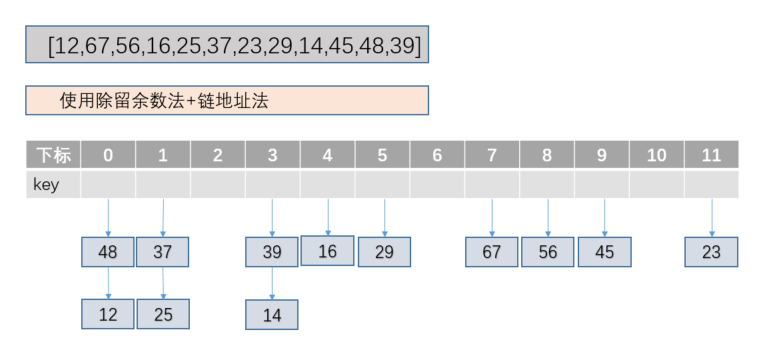

#### Hash算法相关知识
##### 散列技术
> 核心原理：存储位置 = f(关键字)

>　　散列技术是在记录的存储位置和关键字之间建立一个确定的对应关系f，使得每个关键字key都对应到一个存储位置f(key),
这个存放记录的存储空间称之为散列表或者哈希表。


##### 散列函数设计
1. 直接定址法

    ```f(key) = a × key + b```
    
2. 除留余数法

    ```f( key ) = key mod p ( p ≤ m )```
    
> 使用除留余数法的一个经验是，若散列表表长为m，通常p为小于或等于表长（最好接近m)的最小质数

> 　　假设关键字列表为：[12,67,56,16,25,37,23,29,14,45,48,39],m=12,则可以推算出p=11,所以 f(key) = key % 11

##### 散列冲突解决
1. 开放定址法
    
    1.1 线性探测法
    
    ```fi(key) = (f(key)+di) MOD m (di=1,2,3,......,m-1)```
    
    1.2 二次探测法(增加平方运算的目的是为了不让关键字都聚集在 某一块区域)
    
    ```fi(key) = (f(key)+di) MOD m (di = 12, -12, 22, -22,……, q2, -q2, q <= m/2)```
    
    1.3 随机探测法
    
    ```fi(key) = (f(key)+di) MOD m (di是一个随机数列)```
    
2. 链地址法

> 将所有关键字为同义词的结点链接在同一个单链表中。若选定的散列表长度为m，则可将散列表定义为一个由m个头指针组成的指针数组T[0..m-1]
    
##### 除留余数法和链地址法



