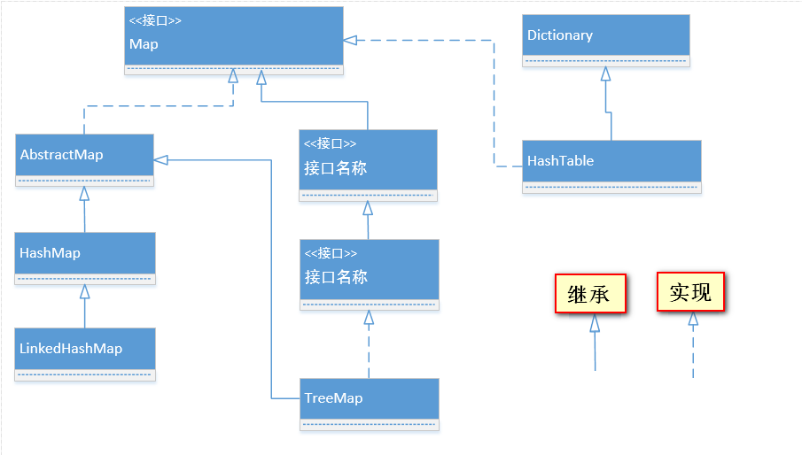
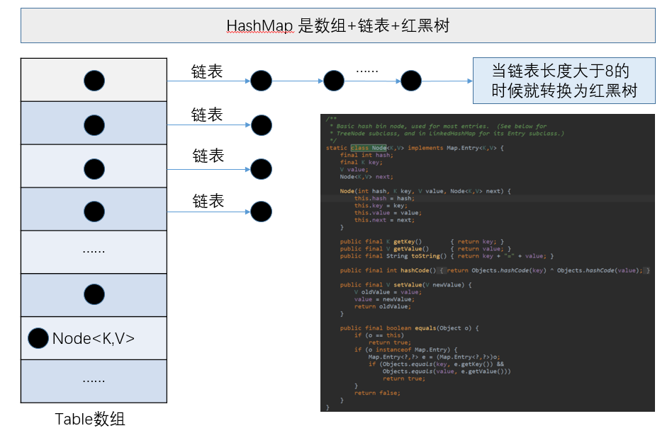
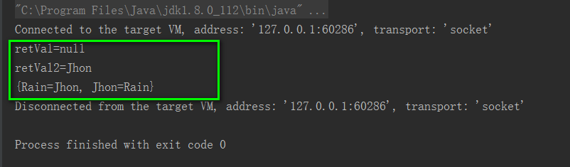
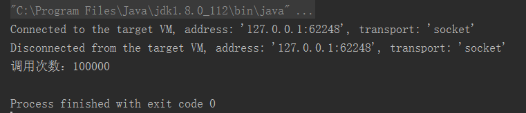

#### Map接口


#### HashMap
##### JDK 1.7 和 JDK 1.8 实现方式的区别
[1].JDK 1.7：HashMap是数组+链表

[2].JDK 1.8：HashMap是数组+链表+红黑树（JDK1.8增加了红黑树部分）


#### ConcurrentHashMap
##### 实现原理
> 分段锁技术实现，将锁的粒度降低。

> JDK1.8的实现已经摒弃了Segment的概念，而是直接用Node数组+链表+红黑树的数据结构来实现，并发控制使用Synchronized和CAS来操作，整个看起来就像是优化过且线程安全的HashMap

##### Show Me The Code
```java
package com.jhon.rain.mapsurround;

import java.util.Map;
import java.util.concurrent.ConcurrentHashMap;

/**
 * <p>功能描述</br> ConcurrentHashMap的使用场景&注意事项 </p>
 * <p>
 *   [1].Concurrency is tricky
 *   [2].putIfAbsent is tricky to use correctly
 *   [3].engineers at Google got it wrong more than 10% of the time
 *   [4].Unless you need to ensure a single value, just use get followed by put if not found
 *   [5].If you need to ensure a single unique value shared by all threads, use putIfAbsent and Check return value
 * </p>
 * @author jiangy19
 * @version v1.0
 * @FileName ConcurrentHashMapUsage
 * @date 2017/10/10 16:13
 */
public class ConcurrentHashMapUsage {

	public static void main(String[] args) throws Exception {
		Map<String, String> map = new ConcurrentHashMap<>();
		map.put("Jhon","Rain");
		String retVal = map.putIfAbsent("Rain","Jhon");
		System.out.println("retVal="+retVal);
		String retVal2 = map.putIfAbsent("Rain","JhonRain");
		System.out.println("retVal2="+retVal2);
		System.out.println(map.toString());
	}
}

```

##### 执行结果



##### ConcurrentHashMap的putIfAbsent方法解析（类似于CAS[Compare And Swap]操作）
##### JDK源码
```java
/**
 * If the specified key is not already associated
 * with a value, associate it with the given value.
 * This is equivalent to
 *  <pre> {@code
 * if (!map.containsKey(key))
 *   return map.put(key, value);
 * else
 *   return map.get(key);
 * }</pre>
 *
 * except that the action is performed atomically.
 *
 * @implNote This implementation intentionally re-abstracts the
 * inappropriate default provided in {@code Map}.
 *
 * @param key key with which the specified value is to be associated
 * @param value value to be associated with the specified key
 * @return the previous value associated with the specified key, or
 *         {@code null} if there was no mapping for the key.
 *         (A {@code null} return can also indicate that the map
 *         previously associated {@code null} with the key,
 *         if the implementation supports null values.)
 * @throws UnsupportedOperationException if the {@code put} operation
 *         is not supported by this map
 * @throws ClassCastException if the class of the specified key or value
 *         prevents it from being stored in this map
 * @throws NullPointerException if the specified key or value is null,
 *         and this map does not permit null keys or values
 * @throws IllegalArgumentException if some property of the specified key
 *         or value prevents it from being stored in this map
 */
 V putIfAbsent(K key, V value);
 
 
/**
* Replaces the entry for the specified key only if currently
* mapped to the specified value.
*
* @implSpec
* The default implementation is equivalent to, for this {@code map}:
*
* <pre> {@code
* if (map.containsKey(key) && Objects.equals(map.get(key), value)) {
*     map.put(key, newValue);
*     return true;
* } else
*     return false;
* }</pre>
*
* The default implementation does not throw NullPointerException
* for maps that do not support null values if oldValue is null unless
* newValue is also null.
*
* <p>The default implementation makes no guarantees about synchronization
* or atomicity properties of this method. Any implementation providing
* atomicity guarantees must override this method and document its
* concurrency properties.
*
* @param key key with which the specified value is associated
* @param oldValue value expected to be associated with the specified key
* @param newValue value to be associated with the specified key
* @return {@code true} if the value was replaced
* @throws UnsupportedOperationException if the {@code put} operation
*         is not supported by this map
*         (<a href="{@docRoot}/java/util/Collection.html#optional-restrictions">optional</a>)
* @throws ClassCastException if the class of a specified key or value
*         prevents it from being stored in this map
* @throws NullPointerException if a specified key or newValue is null,
*         and this map does not permit null keys or values
* @throws NullPointerException if oldValue is null and this map does not
*         permit null values
*         (<a href="{@docRoot}/java/util/Collection.html#optional-restrictions">optional</a>)
* @throws IllegalArgumentException if some property of a specified key
*         or value prevents it from being stored in this map
* @since 1.8
*/
default boolean replace(K key, V oldValue, V newValue) {
 Object curValue = get(key);
 if (!Objects.equals(curValue, oldValue) ||
     (curValue == null && !containsKey(key))) {
     return false;
 }
 put(key, newValue);
 return true;
}
 
```


```java
package com.jhon.rain.mapsurround;

import java.util.Map;
import java.util.concurrent.ConcurrentHashMap;
import java.util.concurrent.CountDownLatch;
import java.util.concurrent.ExecutorService;
import java.util.concurrent.Executors;

/**
 * <p>功能描述</br> 多线程并发的情况下，ConcurrentHashMap使用过程中存在的问题 </p>
 *
 * @author jiangy19
 * @version v1.0
 * @FileName ConcurrentHashMapProblem
 * @date 2017/10/10 18:51
 */
public class ConcurrentHashMapProblem {

	private final Map<String, Long> callCounter = new ConcurrentHashMap<>();

	/**
	 * 获取次数+1
	 *
	 * @param key
	 * @return
	 */
	public long increase(String key) {
		Long previousVal = callCounter.get(key);
		Long newVal = 1L;
		if (previousVal != null) {
			newVal = previousVal + 1;
		}
		callCounter.put(key, newVal);
		return newVal;
	}

	/**
	 * @param key
	 * @return
	 */
	public long increaseNew(String key) {
		Long previousVal, newVal;
		while (true) {
			previousVal = callCounter.get(key);
			if (previousVal == null) {
				newVal = 1L;
				/** 初始化成功，退出循环 **/
				if (callCounter.putIfAbsent(key, 1L) == null) {
					break;
				}
			} else {
				newVal = previousVal + 1;
				/** +1成功，退出循环 **/
				if (callCounter.replace(key, previousVal, newVal)) {
					/** 如果+1失败，说明其他线程已经修改过了旧值 **/
					break;
				}
			}
		}
		return newVal;
	}

	/**
	 * 获取次数
	 *
	 * @param key
	 * @return
	 */
	public Long getCallCount(String key) {
		return callCounter.get(key);
	}

	public static void main(String[] args) throws Exception {
		ExecutorService executor = Executors.newFixedThreadPool(10);
		final ConcurrentHashMapProblem instance = new ConcurrentHashMapProblem();
		int callTimes = 100000;
		final String key = "JhonRain";
		CountDownLatch latch = new CountDownLatch(callTimes);
		for (int i = 0; i < callTimes; i++) {
			executor.submit(new Runnable() {
				@Override
				public void run() {
					//instance.increase(key);
					instance.increaseNew(key);
					latch.countDown();
				}
			});
		}

		try {
			latch.await();
		} catch (Exception e) {
			e.printStackTrace();
		}
		executor.shutdown();
		System.out.println("调用次数：" + instance.getCallCount(key));
	}
}
```
##### 执行结果



#### HashTable


#### TreeMap


#### LinkedHashMap
