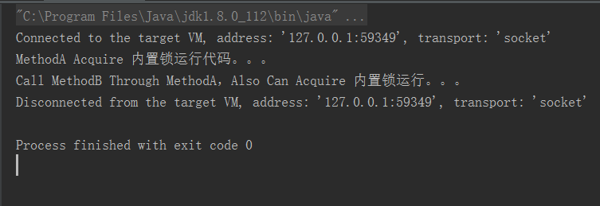
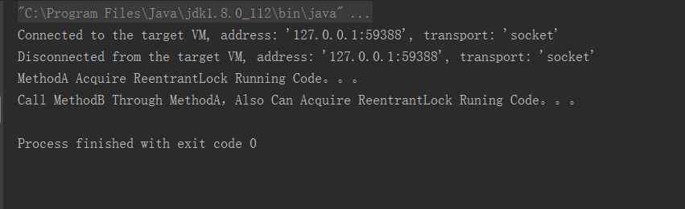

#### ReetrantLock -- 可重入锁  && Synchronized 内置锁 
> 　　若一个程序或子程序可以“安全的被并行执行(Parallel computing)”，则称其为可重入（reentrant或re-entrant）的。锁的操作粒度是"线程"，不是"调用"，同一个线程再次进入同步代码的时候.可以使用自己已经获取到的锁,这就是可重入锁。

##### 内置锁Synchronized 可重入代码示例
```java
package com.jhon.rain.reentrantlock;

/**
 * <p>功能描述</br> 内置锁演示可重入 </p>
 *
 * @author jiangy19
 * @version v1.0
 * @FileName SyncExample
 * @date 2017/10/9 19:14
 */
public class SyncExample {

	public static void main(String[] args) throws Exception {
		new SyncExample().methodA();
	}

	public synchronized void methodA() {
		System.out.println("MethodA Acquire 内置锁运行代码。。。");
		methodB();
	}

	public synchronized void methodB() {
		System.out.println("Call MethodB Through MethodA，Also Can Acquire 内置锁运行。。。");
	}
}

```

运行结果


##### ReetrantLock 可重入代码示例
```java
package com.jhon.rain.reentrantlock;

import java.util.concurrent.locks.Lock;
import java.util.concurrent.locks.ReentrantLock;

/**
 * <p>功能描述</br> Lock/ReentrantLock 可重入示例 </p>
 *
 * @author jiangy19
 * @version v1.0
 * @FileName LockExample
 * @date 2017/10/9 19:15
 */
public class LockExample {

	private Lock lock = new ReentrantLock();

	public static void main(String[] args) throws Exception {
		new LockExample().methodA();
	}

	public synchronized void methodA() {
		lock.lock();
		try {
			System.out.println("MethodA Acquire ReentrantLock Running Code。。。");
			methodB();
		} catch (Exception e) {
			e.printStackTrace();
		} finally {
			lock.unlock();
		}
	}

	public synchronized void methodB() {
		lock.lock();
		try {
			System.out.println("Call MethodB Through MethodA，Also Can Acquire ReentrantLock Runing Code。。。");
		} catch (Exception e) {
			e.printStackTrace();
		} finally {
			lock.unlock();
		}
	}
}

```
执行结果



#### ReentrantLock的使用场景
##### 1.防止重复执行
    1.1 定时任务执行的时间大于下次计划执行的时间
    1.2 后台防止前端页面交互重复触发
##### 2.类似于Synchronized锁的作用
    2.1 锁的方式灵活：公平锁(默认)和不公平锁(允许插队执行)
    2.2 性能更优于Synchronized
    

##### 代码模拟
```java
package com.jhon.rain.reentrantlock;

import java.util.concurrent.locks.Lock;
import java.util.concurrent.locks.ReentrantLock;

/**
 * <p>功能描述</br> Lock的使用场景 </p>
 * <p>
 *   case 1.reentrantLock.tryLock() : 如果已经被lock，则立即返回false不会等待，达到忽略操作的效果
 *   case 2.private Lock lock = new ReentrantLock(); // 默认为不公平锁
 *   case 3.private Lock lock = new ReentrantLock(true); // 公平锁形式
 *   case 4.lock.tryLock(2, TimeUnit.SECONDS); // 如果已经被lock，尝试等待2s，看是否可以获得锁，
 *          如果2s后仍然无法获得锁则返回false继续执行
 * </p>
 * @author jiangy19
 * @version v1.0
 * @FileName LockUseCase
 * @date 2017/10/9 19:33
 */
public class LockUseCase {

	private Lock reentrantLock = new ReentrantLock();

	public static void main(String[] args) throws Exception {

	}

	/**
	 * 逻辑处理
	 */
	public void logicalProcess() {
		if (reentrantLock.tryLock()) {
			try {
				reentrantLock.lock();
				/** Logical Process **/
			} catch (Exception e) {
				e.printStackTrace();
			} finally {
				reentrantLock.unlock();
			}
		}
	}
}

```
