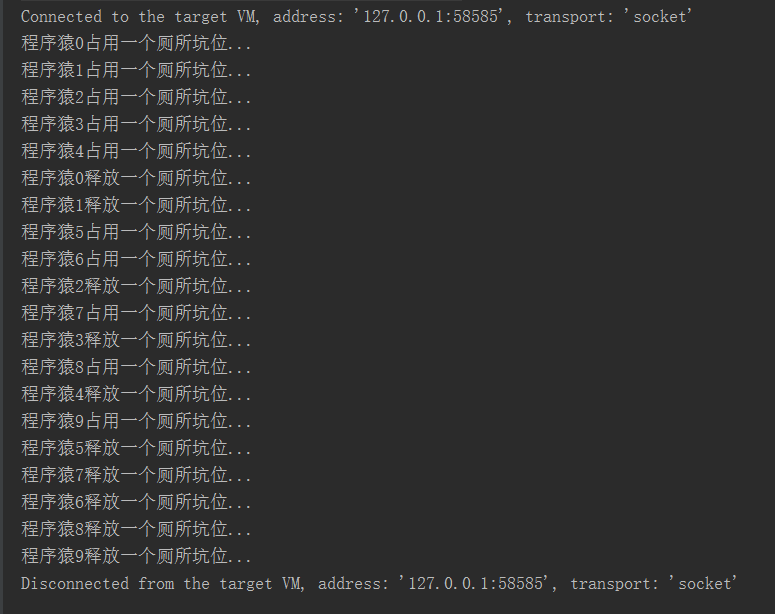

### Semaphore使用
>　　信号量，一般用于对共享资源访问的控制，Semaphore可以控同时访问的线程个数，通过acquire() 获取一个许可，如果没有就等待，而 release() 释放一个许可。

#### 常用API
```java
/** 获取一个许可 **/
public void acquire() throws InterruptedException {}
/** 获取permits个许可 **/
public void acquire(int permits) throws InterruptedException {}
/** 释放一个许可 **/
public void release() {}
/** 释放permits个许可 **/
public void release(int permits) {} 
```
#### 使用场景：
　　相信大家都对上厕所的体会比较深－－每天早上来上班的时候，总会感觉到公司的厕所不够用，哈哈……，其实厕所的坑位个数就相当于我们描述的信号量，一般在早上这样的高峰期都是比较稀缺的。下面我们就用程序来模拟一下这种现实生活中的场景：
##### 程序猿
```java
package com.jhon.rain.semaphore;

import java.util.concurrent.Semaphore;

/**
 * <p>功能描述</br> 程序猿 </p>
 *
 * @author jiangy19
 * @version v1.0
 * @FileName Programmer
 * @date 2017/10/9 16:30
 */
public class Programmer extends Thread {

	private int num;

	private Semaphore semaphore;

	public Programmer(int num, Semaphore semaphore) {
		this.num = num;
		this.semaphore = semaphore;
	}

	@Override
	public void run() {
		try {
			semaphore.acquire();
			System.out.println("程序猿" + this.num + "占用一个厕所坑位...");
			Thread.sleep(2000);
			System.out.println("程序猿" + this.num + "释放一个厕所坑位...");
			semaphore.release();
		} catch (InterruptedException e) {
			e.printStackTrace();
		}
	}
}

```
##### 上班中
```java
package com.jhon.rain.semaphore;

import java.util.concurrent.Semaphore;

/**
 * <p>功能描述</br> 上班中程序猿上厕所竞争坑位  </p>
 * <p>
 *   程序猿0占用一个厕所坑位...
 *	 程序猿1占用一个厕所坑位...
 *	 程序猿2占用一个厕所坑位...
 *	 程序猿3占用一个厕所坑位...
 *	 程序猿4占用一个厕所坑位...
 *	 程序猿0释放一个厕所坑位...
 *	 程序猿1释放一个厕所坑位...
 *	 程序猿5占用一个厕所坑位...
 *	 程序猿6占用一个厕所坑位...
 *	 程序猿2释放一个厕所坑位...
 *	 程序猿7占用一个厕所坑位...
 *	 程序猿3释放一个厕所坑位...
 *	 程序猿8占用一个厕所坑位...
 *	 程序猿4释放一个厕所坑位...
 *	 程序猿9占用一个厕所坑位...
 *	 程序猿5释放一个厕所坑位...
 *	 程序猿7释放一个厕所坑位...
 *	 程序猿6释放一个厕所坑位...
 *	 程序猿8释放一个厕所坑位...
 *	 程序猿9释放一个厕所坑位...
 * </p>
 *
 * @author jiangy19
 * @version v1.0
 * @FileName Working
 * @date 2017/10/9 16:30
 */
public class Working {

	private static final Integer PROGRAMMER_COUNT = 10;

	private static final Integer WASHROOM_COUNT = 5;

	public static void main(String[] args) throws Exception {
		Semaphore semaphore = new Semaphore(WASHROOM_COUNT);
		for (int i = 0; i < PROGRAMMER_COUNT; i++) {
			new Programmer(i, semaphore).start();
		}
	}
}

```

##### 处理结果
