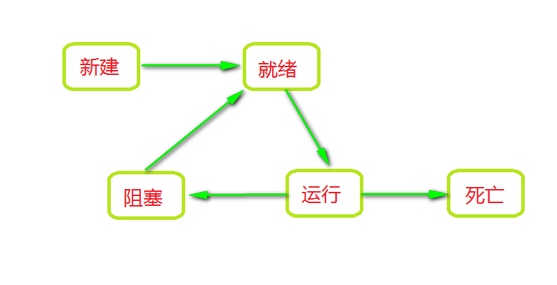

#### Thread 相关的API使用
##### 1.线程的类型
　　Java中有两类线程：User Thread(用户线程)、Daemon Thread(守护线程)

　　如何创建守护线程：
```java
Thread thread = new Thread(()->{
	// TODO
});
thread.setDaemon(true);
thread.start();
```

##### 2.线程的状态
    2.1 新建状态 New
    2.2 就绪状态 Runnable
    2.3 运行状态 Running
    2.4 阻塞状态 Blocked
    2.5 死亡状态 Dead


##### 3.线程阻塞

> 线程可以阻塞于四种状态：

> 1、当线程执行Thread.sleep（）时，它一直阻塞到指定的毫秒时间之后，或者阻塞被另一个线程打断；

> 2、当线程碰到一条wait（）语句时，它会一直阻塞到接到通知（notify（））、被中断或经过了指定毫秒时间为止（若制定了超时值的话）

> 3、线程阻塞与不同I/O的方式有多种。常见的一种方式是InputStream的read（）方法，该方法一直阻塞到从流中读取一个字节的数据为止，它可以无限阻塞，因此不能指定超时时间；

> 4、线程也可以阻塞等待获取某个对象锁的排他性访问权限（即等待获得synchronized语句必须的锁时阻塞）。

> 摘抄自[ImportNew -- Java并发编程（4）：守护线程与线程阻塞的四种情况](http://www.importnew.com/20551.html)